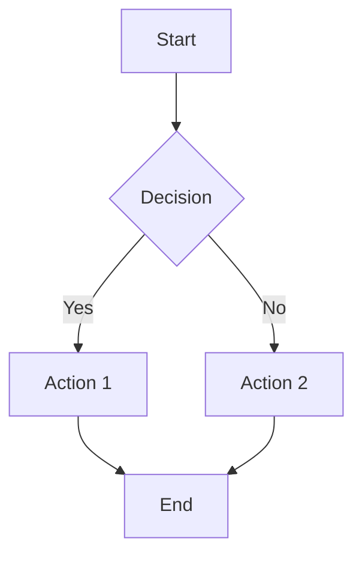
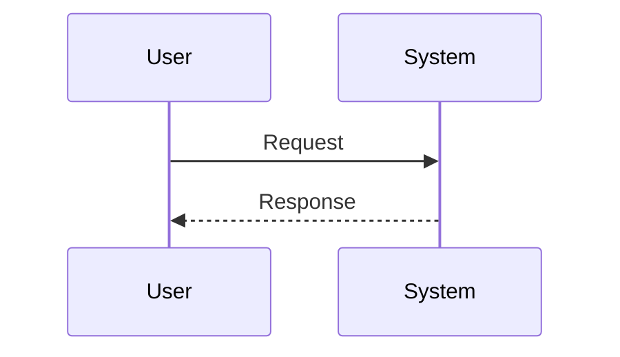
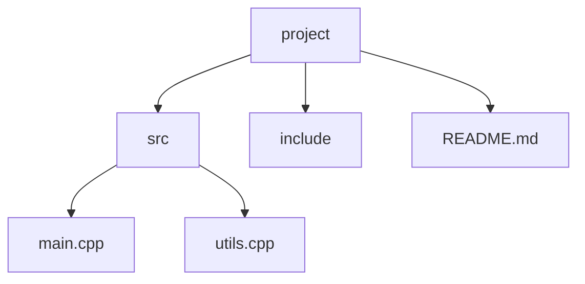

# 0 Markdown 速查表

Markdown 语法快速参考。

## 0.1 基本语法

这些是 John Gruber 的原始设计文档中概述的元素。所有 Markdown 应用程序都支持这些元素。

| 元素 | Markdown 语法 |
|------|--------------|
| 标题 | `# H1`<br>`## H2`<br>`### H3` |
| 粗体 | `**bold text**` |
| 斜体 | `*italicized text*` |
| 引用块 | `> blockquote` |
| 有序列表 | `1. First item`<br>`2. Second item`<br>`3. Third item` |
| 无序列表 | `- First item`<br>`- Second item`<br>`- Third item` |
| 代码 | `` `code` `` |
| 水平线 | `---` |
| 链接 | `[title](https://www.example.com)` |
| 图片 | `` |

## 0.2 扩展语法

这些元素通过添加其他功能来扩展基本语法。并非所有 Markdown 应用程序都支持这些元素。

| 元素 | Markdown 语法 |
|------|--------------|
| 表格 | `\| 语法 \| 说明 \|`<br>`\| ----------- \| ----------- \|`<br>`\| 标题 \| 名称 \|`<br>`\| 段落 \| 文本 \|` |
| 带围栏的代码块 | ```` ``` `<br>`{`<br>`  "firstName": "John",`<br>`  "lastName": "Smith",`<br>`  "age": 25`<br>`}`<br>` ``` ```` |
| 脚注 | `这是一个带脚注的句子。[^1]`<br>`[^1]: 这是脚注。` |
| 标题 ID | `### 我的伟大标题 {#custom-id}` |
| 定义列表 | `术语`<br>`: 定义` |
| 删除线 | `~~世界是平的。~~` |
| 任务列表 | `- [x] 撰写新闻稿`<br>`- [ ] 更新网站`<br>`- [ ] 联系媒体` |
| 表情符号 | `太搞笑了！:joy:` |
| 高亮 | `我需要高亮这些==非常重要的单词==。` |
| 下标 | `H~2~O` |
| 上标 | `X^2^` |

---

# 1 Markdown 基础

Markdown 是一种轻量级标记语言，你可以用它为纯文本文档添加格式元素。

## 1.1 标题

标题使用井号（`#`）创建。井号的数量表示标题级别。

| Markdown | 渲染输出 |
|----------|----------|
| `# Heading 1` | <h1>Heading 1</h1> |
| `## Heading 2` | <h2>Heading 2</h2> |
| `### Heading 3` | <h3>Heading 3</h3> |
| `#### Heading 4` | <h4>Heading 4</h4> |
| `##### Heading 5` | <h5>Heading 5</h5> |
| `###### Heading 6` | <h6>Heading 6</h6> |

**示例：**
```markdown
# 主标题
## 章节标题
### 小节标题
```

> **注意：** 始终在井号符号后添加空格以确保正确渲染。

## 1.2 段落和换行

### 1.2.1 段落

段落通过用空行分隔文本来创建。

**示例：**
```markdown
这是第一个段落。

这是第二个段落。
```

### 1.2.2 换行

换行可以通过两种方式创建：

| 方法 | 语法 | 使用场景 |
|------|------|----------|
| **尾部空格** | 行尾两个空格 | 手动换行 |
| **HTML 标签** | `<br>` | 显式换行 |

**示例：**
```markdown
这是第一行。  
这是第二行。
```

## 1.3 文本格式

### 1.3.1 强调

| 样式 | 语法 | 示例 | 输出 |
| ---- | ---- | ---- | ---- |
| **粗体** | `**text**` 或 `__text__` | `**bold**` | **bold** |
| *斜体* | `*text*` 或 `_text_` | `*italic*` | *italic* |
| ***粗体+斜体*** | `***text***` | `***both***` | ***both*** |
| ~~删除线~~ | `~~text~~` | `~~deleted~~` | ~~deleted~~ |

### 1.3.2 代码格式

**行内代码：** 使用反引号 `` ` ``
```markdown
使用 `printf()` 来显示输出。
```

**代码块：** 使用三个反引号 ` ``` `
<pre>
```cpp
int main() {
    return 0;
}
```
</pre>

> **提示：** 在开头的反引号后指定语言以进行语法高亮。

## 1.4 列表

### 1.4.1 无序列表

使用 `-`、`*` 或 `+` 后跟一个空格。

**示例：**
```markdown
- 第一项
- 第二项
  - 嵌套项
  - 另一个嵌套项
- 第三项
```

### 1.4.2 有序列表

使用数字后跟一个句点。

**示例：**
```markdown
1. 第一步
2. 第二步
   1. 子步骤 A
   2. 子步骤 B
3. 第三步
```

> **注意：** 实际数字不重要——Markdown 会自动重新编号。

### 1.4.3 任务列表

使用 `[ ]` 和 `[x]` 创建可勾选的任务列表。

**示例：**
```markdown
- [x] 已完成的任务
- [ ] 未完成的任务
- [ ] 另一个未完成的任务
```

## 1.5 链接和图片

### 1.5.1 链接

| 类型 | 语法 | 示例 |
|------|------|------|
| **行内** | `[text](url)` | `[Google](https://google.com)` |
| **带标题** | `[text](url "title")` | `[Google](https://google.com "Search")` |
| **引用** | `[text][label]` | `[Google][1]` |

**引用示例：**
```markdown
[Google][1] 和 [GitHub][2]

[1]: https://google.com
[2]: https://github.com
```

### 1.5.2 图片

类似于链接，但带有一个感叹号前缀。

| 类型 | 语法 | 示例 |
|------|------|------|
| **行内** | `` | `` |
| **带标题** | `` | `` |

**示例：**
```markdown

```

## 1.6 引用块

使用 `>` 创建引用块。

**示例：**
```markdown
> 这是一个引用块。
> 它可以跨越多行。
>
> > 这是一个嵌套引用块。
```

**输出：**
> 这是一个引用块。
> 它可以跨越多行。
>
> > 这是一个嵌套引用块。

## 1.7 分隔线

使用三个或更多破折号、星号或下划线创建水平线。

**示例：**
```markdown
---

***

___
```

## 1.8 表格

使用管道符 `|` 和破折号 `-` 创建表格。

**示例：**
```markdown
| 表头 1 | 表头 2 | 表头 3 |
|----------|----------|----------|
| 单元格 1   | 单元格 2   | 单元格 3   |
| 单元格 4   | 单元格 5   | 单元格 6   |
```

**对齐：**
```markdown
| 左对齐 | 居中 | 右对齐 |
|:-----|:------:|------:|
| A    | B      | C     |
```

> **提示：** 在分隔线中使用冒号来控制对齐方式（`:---` 左对齐，`:---:` 居中，`---:` 右对齐）。

## 1.9 转义字符

使用反斜杠 `\` 来转义特殊字符。

| 字符 | 名称 |
|-----------|------|
| `\*` | 星号 |
| `\#` | 井号 |
| `\[\]` | 方括号 |
| `\`\`` | 反引号 |
| `\|` | 管道符 |
| `\\` | 反斜杠 |

**示例：**
```markdown
\*这不是斜体\*
\`这不是代码\`
```

---

# 2 扩展 Markdown 功能

## 2.1 脚注

使用 `[^label]` 语法添加脚注。

**示例：**
```markdown
这是一个带有脚注的声明。[^1]

[^1]: 这是脚注内容。
```

## 2.2 定义列表

某些 Markdown 处理器支持定义列表。

**示例：**
```markdown
术语
: 术语的定义

另一个术语
: 另一个定义
```

## 2.3 表情符号

使用表情符号简码或 Unicode 字符。

**示例：**
```markdown
:smile: :heart: :thumbsup:
```

输出：😄 ❤️ 👍

## 2.4 HTML 行内

Markdown 允许你使用原始 HTML 标签进行高级格式设置。

| HTML 标签 | 用途 | 示例 |
|----------|---------|---------|
| `<br>` | 换行 | `Line 1<br>Line 2` |
| `<center>` | 居中对齐 | `<center>居中文字</center>` |
| `<u>` | 下划线 | `<u>下划线文字</u>` |
| `<sub>` | 下标 | `H<sub>2</sub>O` → H₂O |
| `<sup>` | 上标 | `x<sup>2</sup>` → x² |
| `<mark>` | 高亮 | `<mark>高亮显示</mark>` |

**示例：**
```markdown
这是 <u>下划线</u>，这是 <mark>高亮显示</mark>。

化学公式：H<sub>2</sub>O
数学指数：x<sup>2</sup> + y<sup>2</sup> = z<sup>2</sup>
```

## 2.5 可折叠部分

使用 HTML `<details>` 和 `<summary>` 标签创建可折叠内容。

**示例：**
```markdown
<details>
<summary>点击展开</summary>

此内容默认隐藏。
- 项目 1
- 项目 2
- 项目 3

</details>
```

**输出：**
<details>
<summary>点击展开</summary>

此内容默认隐藏。
- 项目 1
- 项目 2
- 项目 3

</details>

## 2.6 数学表达式

许多平台支持 LaTeX 数学表达式。

| 语法 | 类型 | 示例 |
|--------|------|---------|
| `$...$` | 行内数学 | `$E = mc^2$` |
| `$$...$$` | 块级数学 | `$$\sum_{i=1}^n i = \frac{n(n+1)}{2}$$` |

**行内示例：**
```markdown
二次公式是 $x = \frac{-b \pm \sqrt{b^2 - 4ac}}{2a}$。
```

**块级示例：**
```markdown
$$
\int_{-\infty}^{\infty} e^{-x^2} dx = \sqrt{\pi}
$$
```

> **注意：** 数学支持因平台而异（GitHub、Jupyter、Typora 支持；标准 Markdown 不支持）。

## 2.7 图表（Mermaid）

某些平台支持用于图表的 Mermaid 语法。

**流程图示例：**
<pre>

</pre>

**序列图示例：**
<pre>

</pre>

> **注意：** Mermaid 需要平台支持（GitHub、Notion、Typora 等）。

## 2.8 YAML 前置元数据

在文档开头使用 YAML 格式添加元数据。

**示例：**
```markdown
---
title: 我的文档
author: John Doe
date: 2024-01-15
tags: [markdown, tutorial]
---

# 文档内容

从这里开始...
```

> **使用场景：** 在静态网站生成器（Jekyll、Hugo）和笔记应用（Obsidian）中很常见。

## 2.9 自动目录

某些平台会自动从标题生成目录。

| 平台 | 语法 | 描述 |
|----------|--------|-------------|
| **GitHub** | 自动 | 点击文件名旁边的列表图标 |
| **Typora** | `[TOC]` | 插入目录 |
| **VS Code** | 扩展 | 使用 Markdown All in One 扩展 |

**手动锚点链接：**
```markdown
# 目录
- [章节 1](#section-1)
- [章节 2](#section-2)

## Section 1
内容在这里...

## Section 2
内容在这里...
```

## 2.10 文本高亮（扩展）

某些平台支持使用 `==` 的高亮语法。

| 语法 | 输出 | 支持 |
|--------|--------|---------|
| `==highlighted==` | ==highlighted== | 有限（Obsidian、Typora） |
| `<mark>text</mark>` | <mark>text</mark> | 通用（HTML） |

**建议：** 使用 `<mark>` 以获得更好的兼容性。

## 2.11 注释

在 Markdown 中添加不可见的注释。

| 语法 | 用法 |
|--------|-------|
| `<!-- comment -->` | HTML 注释（标准） |
| `[//]: # (comment)` | 链接引用注释 |

**示例：**
```markdown
<!-- 这是一个注释，在渲染输出中不可见 -->

可见文字在这里。

[//]: # (这是另一种类型的注释)
```

## 2.12 键盘按键

使用 `<kbd>` 标签表示键盘按键。

| 语法 | 输出 | 使用场景 |
|--------|--------|----------|
| `<kbd>Ctrl</kbd>` | <kbd>Ctrl</kbd> | 单个按键 |
| `<kbd>Ctrl</kbd>+<kbd>C</kbd>` | <kbd>Ctrl</kbd>+<kbd>C</kbd> | 组合键 |

**示例：**
```markdown
按 <kbd>Ctrl</kbd>+<kbd>S</kbd> 保存。

使用 <kbd>↑</kbd><kbd>↓</kbd><kbd>←</kbd><kbd>→</kbd> 进行导航。
```

**输出：**
按 <kbd>Ctrl</kbd>+<kbd>S</kbd> 保存。

使用 <kbd>↑</kbd><kbd>↓</kbd><kbd>←</kbd><kbd>→</kbd> 进行导航。

## 2.13 代码块功能

### 2.13.1 带行号的语法高亮

某些平台支持代码块中的行号。

<pre>
```python linenums="1"
def hello():
    print("Hello")
    return True
```
</pre>

> **注意：** `linenums` 属性由 MkDocs Material 支持，不是标准 Markdown。

### 2.13.2 高亮特定行

在代码块中高亮特定行。

<pre>
```python hl_lines="2 3"
def hello():
    print("Hello")  # 此行高亮
    return True     # 此行高亮
```
</pre>

> **注意：** `hl_lines` 是扩展功能（MkDocs Material）。

### 2.13.3 代码块标题

为代码块添加标题。

<pre>
```python title="hello.py"
def hello():
    print("Hello World")
```
</pre>

## 2.14 Abbr（缩写）

定义悬停时显示工具提示的缩写（某些平台）。

**语法：**
```markdown
HTML 规范由 W3C 维护。

*[HTML]: Hyper Text Markup Language
*[W3C]: World Wide Web Consortium
```

**输出：** 将鼠标悬停在 HTML 或 W3C 上可查看定义。

> **注意：** 由 PHP Markdown Extra、MkDocs 和其他一些风格支持。

## 2.15 上标和下标（替代语法）

某些平台支持 Markdown 原生的上标/下标。

| 语法 | 输出 | 平台 |
|--------|--------|----------|
| `x^2^` | x^2^ | Pandoc、Obsidian、Typora |
| `H~2~O` | H~2~O | Pandoc、Obsidian、Typora |
| `x<sup>2</sup>` | x<sup>2</sup> | 通用（HTML） |

**建议：** 使用 HTML 标签（`<sup>`、`<sub>`）以获得更好的兼容性。

## 2.16 视频嵌入

使用 HTML 或平台特定语法嵌入视频。

**HTML5 视频：**
```markdown
<video src="video.mp4" controls width="640" height="360"></video>
```

**YouTube（如果平台支持）：**
```markdown
[](https://www.youtube.com/watch?v=VIDEO_ID "Video Title")
```

**IFrame（对于支持的平台）：**
```markdown
<iframe width="560" height="315" src="https://www.youtube.com/embed/VIDEO_ID"></iframe>
```

## 2.17 智能标点

Markdown 处理器通常将直引号转换为弯引号。

| 输入 | 输出 | 描述 |
|-------|--------|-------------|
| `"Hello"` | "Hello" | 直引号 |
| `"Hello"` (smart) | "Hello" | 弯引号（印刷体） |
| `'` | ' | 撇号 |
| `--` | -- | 短破折号 |
| `---` | --- | 长破折号 |
| `...` | ... | 省略号 |

**通过以下方式禁用：**
```markdown
使用 `"`直引号`"` 通过转义或使用代码范围。
```

## 2.18 脚注（高级）

多次引用同一个脚注。

```markdown
这里需要一个脚注[^1]，这里又引用了一次[^1]。

另一个脚注[^2]用于对比。

[^1]: 同一个脚注被引用了两次。
[^2]: 不同的脚注。
```

## 2.19 嵌套元素

你可以将大多数 Markdown 元素相互嵌套。

**带列表的引用块：**
```markdown
> ### 重要注意事项：
> - 第一项
> - 第二项
>   ```cpp
>   引用块内列表内的代码
>   ```
```

**带代码和强调的列表：**
```markdown
- **粗体项**
  ```python
  print("code")
  ```
- *斜体项* 带 `行内代码`
```

## 2.20 目录树表示

使用代码块或 ASCII 艺术表示目录树。

**使用代码块：**
<pre>
```
project/
├── src/
│   ├── main.cpp
│   └── utils.cpp
├── include/
│   └── header.h
├── README.md
└── CMakeLists.txt
```
</pre>

**使用 Mermaid：**
<pre>

</pre>

## 2.21 GitHub 提示框（Callouts）

GitHub 风格 Markdown 支持特殊的提示框语法用于突出显示信息。

| 语法 | 类型 | 用途 |
|--------|------|---------|
| `> [!NOTE]` | 注意 | 有用信息 |
| `> [!TIP]` | 提示 | 有帮助的建议 |
| `> [!IMPORTANT]` | 重要 | 关键信息 |
| `> [!WARNING]` | 警告 | 需要谨慎 |
| `> [!CAUTION]` | 谨慎 | 潜在的负面结果 |

**示例：**
```markdown
> [!NOTE]
> 这是用于额外上下文的注释。

> [!TIP]
> 这是帮助用户更好地做事的提示。

> [!IMPORTANT]
> 这是用户需要知道的重要信息。

> [!WARNING]
> 这是关于潜在问题的警告。

> [!CAUTION]
> 这提醒可能存在的数据丢失。
```

**输出：**
> [!NOTE]
> 这是用于额外上下文的注释。

> [!TIP]
> 这是帮助用户更好地做事的提示。

> **注意：** 仅在 GitHub 和一些现代平台上支持。

## 2.22 代码块中的 Diff

使用 `diff` 语言标识符显示代码差异。

**示例：**
<pre>
```diff
  function hello() {
-   console.log("Hello");
+   console.log("Hello World");
  }
```
</pre>

**输出：**
```diff
  function hello() {
-   console.log("Hello");
+   console.log("Hello World");
  }
```

> **使用场景：** 非常适合在文档或 PR 描述中显示更改。

## 2.23 自定义标题 ID

为标题添加自定义 ID 以便链接。

**语法：**
```markdown
## 长章节标题 {#custom-id}

[链接到章节](#custom-id)
```

**没有自定义 ID：**
ID 是从标题文本自动生成的：`## Hello World` → `#hello-world`

**有自定义 ID：**
`## Hello World {#hw}` → 可以使用 `[Link](#hw)` 链接

> **注意：** 由 GitHub、Pandoc、MkDocs 和许多其他平台支持。

## 2.24 GitHub 特定引用

GitHub 的特殊语法。

| 语法 | 输出 | 描述 |
|--------|--------|-------------|
| `@username` | @octocat | 提及用户 |
| `#123` | #123 | 引用 Issue/PR |
| `GH-123` | GH-123 | 替代 Issue 引用 |
| `user/repo#123` | user/repo#123 | 跨仓库引用 |
| `commit-sha` | `abc1234` | 引用提交 |
| `~label` | ~bug | 引用标签（某些上下文） |

**示例：**
```markdown
感谢 @alice 的帮助！

这修复了 #42 并与 organization/repo#100 相关。

详情请参阅提交 7d3c5a9。
```

## 2.25 HTML 中的 Markdown

你可以通过添加 `markdown="1"` 在块级 HTML 标签内使用 Markdown（某些平台）。

**示例：**
```markdown
<div markdown="1">

# 这个 H1 被解析为 Markdown

- 列表项 1
- 列表项 2

</div>
```

> **注意：** 这是平台特定的。并非所有 Markdown 处理器都支持它。

## 2.26 表格中的换行

使用 `<br>` 在表格单元格内换行。

**示例：**
```markdown
| 表头 | 描述 |
|--------|-------------|
| 项目 1 | 第 1 行<br>第 2 行<br>第 3 行 |
| 项目 2 | 单行 |
```

**输出：**

| 表头 | 描述 |
|--------|-------------|
| 项目 1 | 第 1 行<br>第 2 行<br>第 3 行 |
| 项目 2 | 单行 |

## 2.27 徽章/盾牌

使用 Shields.io 为你的项目创建徽章。

**示例：**
```markdown


```

**输出：**


**常用徽章：**
- 构建状态
- 版本
- 许可证
- 下载量
- 代码覆盖率
- 依赖状态

> **提示：** 访问 [shields.io](https://shields.io) 生成自定义徽章。

---

# 3 最佳实践

## 3.1 文档结构

1. **以 H1 开头**：每个文档应该有且只有一个 `# 标题`
2. **层级结构**：不要跳过级别（不要从 `##` 跳到 `####`）
3. **间距**：在标题前后添加空行

## 3.2 可读性

- 使用 **粗体** 强调，不要用全大写
- 使用 `代码` 表示文件名、命令和代码
- 使用 > 引用块表示重要注释或引用
- 尽可能保持每行少于 80 个字符

## 3.3 兼容性

| 功能 | 标准 Markdown | GitHub 风格 | CommonMark |
|---------|-------------------|-----------------|------------|
| 表格 | ❌ | ✅ | ❌ |
| 任务列表 | ❌ | ✅ | ❌ |
| 脚注 | ❌ | ❌ | ❌ |
| 删除线 | ❌ | ✅ | ❌ |

> **注意：** 并非所有 Markdown 功能都能在所有地方使用。请查看你平台的文档。
